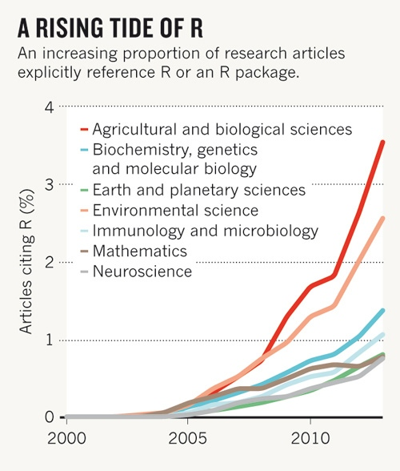
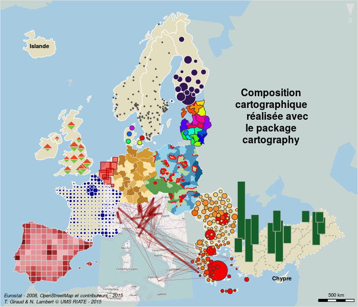
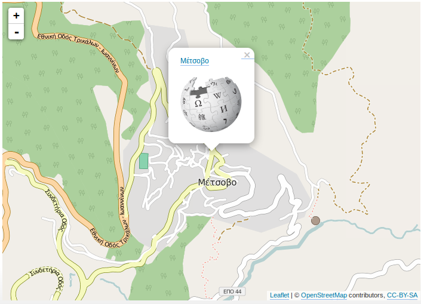
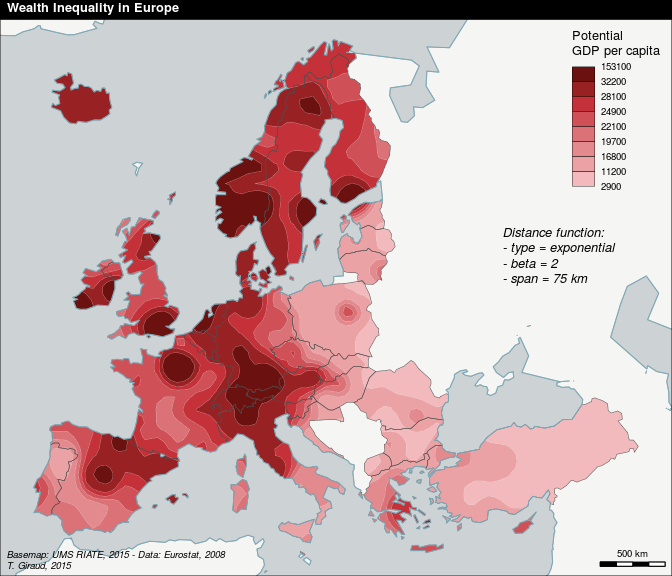
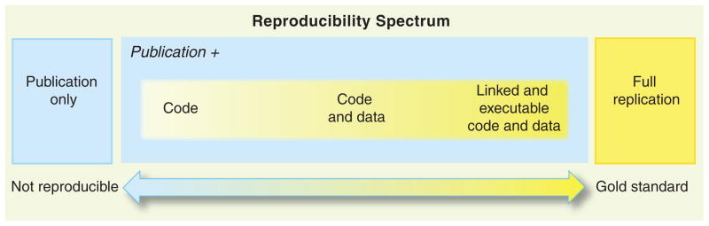

## Presentation Outline

- What is R?

- Cartography

- Spatial Analysis

- Reproducible Research


# What is R?

## What is R?
- R is a language and environment that provides a wide variety of statistical and graphical techniques, and is highly extensible. 

- R is available as Free Software under the terms of GNU General Public License.

- R is cross-platform (GNU/Linux, Windows, OS X).


  
<small><small>[r-project website](https://www.r-project.org/about.html)</small></small>


## R Popularity and Vitality

- 119 254 R questions on [StackOverflow](https://stackoverflow.com/questions/tagged/r)

- 7 727 [user-contributed packages](https://cran.rstudio.com/)

- Preferred language of self-proclaimed data scientists on [LinkedIn](http://blog.revolutionanalytics.com/2015/11/new-surveys-show-continued-popularity-of-r.html)

- Among top languages on [GitHub](http://githut.info/)

- Five updates in 2015

- 174 [Local R User Groups](http://blog.revolutionanalytics.com/local-r-groups.html), 2 in Greece ([Patras](http://www.meetup.com/Patras-R-Users-Group) & [Athens](http://www.meetup.com/AthensR/))

## R Popularity and Vitality {.smaller}
  
Sylvia Tippmann/Source: Elsevier Scopus database


## R Environment 

- R Base: [R](https://www.r-project.org/)

- User-contributed Packages: [The Comprehensive R Archive Network](http://cran.cc.uoc.gr/mirrors/CRAN/)

- Integrated Development Environment (IDE): [RStudio](https://www.rstudio.com/) 


## R Usage 

A look at RStudio and some basic examples of code...

[basic_examples.R]()
```{r}
# basic operations
3 + 3 

3 - 1

3 ** 2

9 ** (1/2)

# create objects
v1 <- 12
v1
class(v1)

v2 <- "foo"
v2
class(v2)
nchar(v2)

v3 <- c(1,4,6,3,7,10)
v3
class(v3)

max(v3)
min(v3)
mean(v3)
median(v3)
length(v3)

# get help on a function
?max

# more complex objects
df <- data.frame(var1 = c(1,2,3,4,5,6), 
                 var2 = c("A", "A", "B", "C", "A", "C"), 
                 var3 = v3 )
df
class(df)
summary(df)

# import a file in R
nuts2data <- read.csv("data/nuts2data.csv")
class(nuts2data)
nrow(nuts2data)
ncol(nuts2data)
dim(nuts2data)

# show the first lines of the data frame
head(nuts2data)

# add a variable
nuts2data$act <- nuts2data$emp + nuts2data$unemp

# show the first lines of the data frame
head(nuts2data)

# get a summary on the dataset
summary(nuts2data)

# get statistics on a variable
mean(nuts2data$gdp)
median(nuts2data$gdp)
sd(nuts2data$gdp)

# plot an histogram
hist(x = nuts2data$gdp)
hist(x = nuts2data$gdp, breaks = 20)

# plot a boxplot
boxplot(nuts2data$act)

# plot a graphic
plot(x = nuts2data$gdp, y = nuts2data$act)

# plor a customized graphic
options(scipen=5)
plot(x = nuts2data$gdp, y = nuts2data$act, 
     pch = 21, cex = 1, col = "grey20", bg = "grey70",
     frame = FALSE, las = 1, cex.axis = 0.8,
     xlab = "GDP", 
     ylab =  "Active population", 
     main = "Relation between GDP and\nActive population in Europe", 
     sub = "Eurostat, 2008")


# install a package
# install.packages("ineq")

# load a package 
library(ineq)

# compute the Gini index for the gdp distribution
# https://en.wikipedia.org/wiki/Gini_coefficient
giniGDP <- Gini(x = nuts2data$gdp)

# compute the Lorentz curve
lorentzGDP <- Lc(nuts2data$gdp)

# plot the Lorentz curve
plot(lorentzGDP, asp = 1)
# the index on the plot
text(x = 0.2, y = 0.6, 
     labels = paste("Gini Index: ", round(giniGDP,1), sep = ""), 
     pos = 4)

```


# Cartography

## {.flexbox .vcenter}

 


## Spatial Data Handling

Two fundamental packages:  

* `sp`: handle and display of spatial objects
* `rgdal`: import/export spatial objects, manage cartographic projections

[spatial_data_handling.R]()
```{r}
# Handling spatial data
library(sp) # display and manage spatial objects
library(rgdal) # import shapefiles & manage projection

# import shapfiles
road <- readOGR(dsn = "data/shp", layer = "odiko_souli")
localities <- readOGR(dsn = "data/shp", layer = "oikismoi_souli")
landcover <- readOGR(dsn = "data/shp", layer = "souli_corine")

# class of imported objects
class(road)
class(localities)
class(landcover)

# what is in spatial objects
head(road@data)
road@bbox
road@proj4string

# add projection info
landcover@proj4string
landcover@proj4string <- localities@proj4string
landcover@proj4string

# display the map
plot(landcover, col = "grey80", lwd = "0.5", border = "grey50")
plot(road, col = "red", lwd = 2, add = TRUE)
plot(localities, col = "white", cex = 1.5, pch = 21, add = TRUE)
title("Souli")

```


## Thematic cartography

The `cartography` package allows various **cartographic representations** and some additional features: 

* Proportional symbols maps  
* Chroropleth maps   
* Typology maps    
* Flow maps   
* Discontinuities maps   
* Cartographic palettes   
* Layout   
* Nice legends   
* Access to cartographic API   
* Irregular polygons to regular grid transformation with data handling  

## Thematic cartography

Basic examples...

```{r}
library(cartography)
data("nuts2006")
## Proportional Symbols 
# Countries plot
plot(nuts0.spdf)
# Population plot on proportional symbols
propSymbolsLayer(spdf = nuts0.spdf, df = nuts0.df, var = "pop2008")


# Layout plot
layoutLayer(title = "Countries Population in Europe", 
            sources = "Eurostat, 2008", 
            scale = NULL, 
            frame = TRUE,
            col = "black", 
            coltitle = "white",
            bg = "#D9F5FF",
            south = TRUE, 
            extent = nuts0.spdf)
# Countries plot
plot(nuts0.spdf, col = "grey60",border = "grey20", add=TRUE)
# Population plot on proportional symbols
propSymbolsLayer(spdf = nuts0.spdf, df = nuts0.df, 
                 var = "pop2008", k = 0.01,
                 symbols = "square", col =  "#920000",
                 legend.pos = "right", 
                 legend.title.txt = "Total\npopulation (2008)", 
                 legend.style = "c")


## Choropleth Layer
nuts2.df$unemprate <- nuts2.df$unemp2008/nuts2.df$act2008*100
choroLayer(spdf = nuts2.spdf, df = nuts2.df, var = "unemprate")

choroLayer(spdf = nuts2.spdf,
           df = nuts2.df,
           var = "unemprate",
           method = "quantile",
           nclass = 8, 
           lwd = 0.5,
           col = carto.pal(pal1 = "turquoise.pal", n1 = 8),
           border = "grey40",
           add = FALSE,
           legend.pos = "right",
           legend.title.txt = "Unemployement\nrate (%)",
           legend.values.rnd = 1)

plot(nuts0.spdf, add=T, border = "grey40")
layoutLayer(title = "Unemployement in Europe",
            sources = "Eurostat, 2008",
            frame = TRUE,
            col = "black",
            south = TRUE, 
            coltitle = "white")

```


## Thematic cartography

More customized examples in the package vignette.  

Access to the vignette in R:  
```{r, eval=FALSE}
vignette(topic = "cartography")
```
Access to the vignette on the web:   
[Commented Scripts to Build Maps with cartography](https://cran.r-project.org/web/packages/cartography/vignettes/cartography.html)


## Interactive Maps
With the `leaflet` package
```{r, eval=FALSE}
library(leaflet)
# initialize a map
m <- leaflet(width = 700, height = 500)
# add a basemap
m <- addTiles(map = m)
# center on a localization
m <- setView(map = m, lng = 21.182957, lat = 39.771098, zoom = 15)
# add a pop-up
m <- addPopups(map = m, lng = 21.182957, lat = 39.771098, 
               popup = '<a href="https://el.wikipedia.org/wiki/%CE%9C%CE%AD%CF%84%CF%83%CE%BF%CE%B2%CE%BF">
               Μέτσοβο                       </a><br/><br/>
               ')
# affichage de la carte
m
```


## Interactive Maps

```{r, echo = FALSE, message=FALSE, fig.height=6, fig.width=6, cache=FALSE, results = 'asis'}
library(leaflet)
# initialize a map
m <- leaflet(width = 700, height = 500)
# add a basemap
m <- addTiles(map = m)
# center on a localization
m <- setView(map = m, lng = 21.182957, lat = 39.771098, zoom = 15)
# add a pop-up
m <- addPopups(map = m, lng = 21.182957, lat = 39.771098, 
               popup = '<a href="https://el.wikipedia.org/wiki/%CE%9C%CE%AD%CF%84%CF%83%CE%BF%CE%B2%CE%BF">
               Μέτσοβο                       </a><br/><br/>
               ')
# affichage de la carte
m
```


## Interactive Maps



# Spatial Analysis

## {.flexbox .vcenter}
 


## Geoprocessing 

One fundamental package:  
The `rgeos` package gives access to the GEOS ([Geometry Engine - Open Source](http://trac.osgeo.org/geos/)) library.  

* Area / Perimeter 
* Distances  
* Buffer
* Overlap / intersect / difference
* Contains / within
* Union
* ...

## Distance calculation
Euclidean distance vs. Road distance


```{r}
# Handling spatial data
library(sp) # display and manage spatial objects
library(rgdal) # import shapefiles & manage projection
library(cartography) # mapping functions
library(osrm) # road time-distance
library(rgeos) # geocomputations

# import shapfiles
road <- readOGR(dsn = "data/shp", layer = "odiko_souli")
localities <- readOGR(dsn = "data/shp", layer = "oikismoi_souli")
landcover <- readOGR(dsn = "data/shp", layer = "souli_corine")
landcover@proj4string <- localities@proj4string


# Compute distances
row.names(localities) <- localities@data$OBJECTID
dist <- gDistance(localities[1:5,], byid = TRUE) 
distkm <- round(dist/1000, 0)
distkm
distmin <- osrmTable(loc = localities@data[1:5,], 
                     locId = "OBJECTID", locLat = "LAT", locLon = "LON") 

distmin$distance_table

# get OpenStreetMap basemap
osm <- getTiles2(localities[1:5,], crop = T)
tilesLayer2(osm)
plot(road, col = "red", lwd = 2, add = TRUE)
plot(localities[1:5,], add=T)
labelLayer(spdf = localities[1:5, ], df = localities[1:5, ]@data, 
           txt = "OBJECTID", pos = 3)

# extract two points
start <- localities[localities$OBJECTID=="2923",]
end <- localities[localities$OBJECTID=="2931",]
plot(start, col="green", add=TRUE, pch = 20, cex = 3)
plot(end, col="orange", add=TRUE, pch = 20, cex = 3)

# time and distance between the two points
roadtrip <- osrmViaroute(srcLon =  start$LON, srcLat =  start$LAT, 
                         dstLon =  end$LON, dstLat = end$LAT)
roadtrip

# get the travel geometry
longroad <- osrmViarouteGeom(srcLon = start$LON, srcLat = start$LAT, 
                             dstLon = end$LON, dstLat = end$LAT, sp = TRUE, 
                             srcId = start$OBJECTID, dstId = end$OBJECTID)
class(longroad)
longroad@proj4string
# reproject the travel geometry
longroad <- spTransform(x = longroad, CRSobj = road@proj4string)

# Map the travel
osm2 <- getTiles2(longroad, crop = TRUE)
tilesLayer2(osm2)
plot(longroad, col = "red", add=T, lwd = 2)
plot(start, col="green", add=TRUE, pch = 20, cex = 3)
plot(end, col="orange", add=TRUE, pch = 20, cex = 3)

```


## Basic Point Pattern Analysis

An example of (very) basic point pattern analysis of geocoded tweets.

```{r}
# data import
library(cartography)
data(nuts2006)
load("data/tweets.RData")
# Map of all the tweets 
par(mar = c(0,0,1.2,0))
plot(frame.spdf, col = "#A2C4F5", add= F, border = NA)
plot(graticule.spdf, add=T, border = "white", lwd = 0.5)
plot(countries.spdf, col = "grey50", border = NA, add=T)
plot(nuts0.spdf, add=T, col = "black", border = "grey50", lwd = 0.5)
plot(coasts.spdf, col = '#DCE8FA', add=T)
plot(marseillegeo, col = '#1A7832', pch = ".", add=T)
layoutLayer(frame = F, title = 'Tweets Quoting Marseille',
            sources = "DMI - Amsterdam, 2015",
            author = "T. Giraud",
            south = T, scale = NULL)
text(x = 5564810,y = 4098997, labels = "Each dot is a tweet", 
     pos = 4, cex = 0.8, col = "white" )


# intersection between tweets & states
tweetsInNuts0 <- over(x = marseillegeo, y = nuts0.spdf)
tweetsInNuts0$nb <- 1
# counting tweets inside countries
tweetspercountry <- aggregate(x = tweetsInNuts0$nb, 
                              by = list(tweetsInNuts0$name), 
                              FUN = sum)
names(tweetspercountry) <- c("name", "nbtweets")
head(tweetspercountry[order(tweetspercountry$nbtweets, decreasing = T),])

# Create a grid of points
hexapoints <- spsample(x = nuts0.spdf, cellsize = 40000, type = 'hexagonal')
# convert the point grid into hexagon grid
hexapoly <- HexPoints2SpatialPolygons(hex = hexapoints)
datahexa <- data.frame(id = row.names(hexapoly), x = 1)
row.names(datahexa) <- datahexa$id
hexapoly <- SpatialPolygonsDataFrame(Sr = hexapoly, data = datahexa)
# Display hexagons
par(mar = c(0,0,0,0))
plot(hexapoly)


# intersection between tweets and hexagons
tweetsInHexaPoly <- over(x = marseillegeo, y = hexapoly)
# counting the tweets
marseilletweethexapoly <- aggregate(x = tweetsInHexaPoly$x, 
                                    by = list(tweetsInHexaPoly$id), FUN = sum)
names(marseilletweethexapoly) <- c("id", "n")

# Map 
par(mar = c(0,0,1.2,0))
plot(frame.spdf, col = "#A2C4F5", add= F, border = NA)
plot(graticule.spdf, add=T, border = "white", lwd = 0.5)
plot(countries.spdf, col = "grey50", border = NA, add=T)
plot(nuts0.spdf, add=T, col = "grey40", border = "grey50", lwd = 0.5)
plot(coasts.spdf, col = '#DCE8FA', add=T)
choroLayer(spdf = hexapoly[hexapoly@data$id %in% marseilletweethexapoly$id,], 
           df = marseilletweethexapoly, 
           var = "n", border = NA, method = "geom", 
           nclass = 5, legend.pos = "right", 
           legend.frame = TRUE,
           col = c("#B8D9A9" ,"#8DBC80" ,"#5D9D52" ,
                   "#287A22" ,"#17692C"), add = TRUE,
           legend.title.txt = "Number of   \ntweets")

layoutLayer(frame = F, title = 'Tweets quoting Marseille',
            sources = "DMI - Amsterdam, 2015",
            author = "T. Giraud",
            south = T, scale = NULL)


```

## Discontinuities
How to extracts discontinuities (borders) between regions.

```{r}
data(nuts2006)
nuts0.contig.spdf <- getBorders(nuts0.spdf)
nuts0.contig.spdf$col <- sample(x = rainbow(96))
plot(nuts0.spdf, border = NA, col = "grey60")
plot(nuts0.contig.spdf, col = nuts0.contig.spdf$col, lwd = 3, add=T)
layoutLayer(title = 'State Borders',
            author = "T. Giraud", sources = "",
            south = T, scale = NULL)


nuts0.df$gdphab <- nuts0.df$gdppps2008 * 1000000 / nuts0.df$pop2008
par(mar = c(0,0,1.2,0))
choroLayer(spdf = nuts0.spdf, df = nuts0.df, 
           var = "gdphab", method = "q6",
           legend.title.txt = "PIB par habitants\n(en euros)",  
           legend.values.rnd = 0, legend.pos = "topright", add=F)
plot(nuts0.spdf, col=NA, lwd=1, border="white", add=T)
discLayer(spdf = nuts0.contig.spdf, df = nuts0.df, 
          dfid = "id", spdfid1 = "id1", spdfid2 = "id2",
          var = "gdphab", col="red", nclass=5, 
          legend.pos = "right", legend.values.rnd = 0,
          legend.title.txt = "Différentiel de \nPIB par habitants", 
          method="equal", threshold = 0.5, sizemin = 1,
          sizemax = 8, type = "abs", add=TRUE )
layoutLayer(title = 'Différentiels de richesse en Europe',
            author = "T. Giraud", sources = "Eurostat, 2008",
            scale = NULL)
```


## Spatial Smoothing
The `SpatialPosition` package allow to compute Stewart potentials (gravitational potential)
$$
A_i = \sum_{j=1}^n O_j f(d_{ij})
$$

- $A_i$ potentiel en $i$
- $O_j$ stock de population sur $j$ 
- $f(d_{ij})$ fonction négative de la distance entre $i$ et $j$

```{r}
library(cartography)
library(SpatialPosition)
data(nuts2006)

# Compute the GDP per capita variable
nuts3.df$gdpcap <- nuts3.df$gdppps2008 * 1000000 / nuts3.df$pop2008

# Discretize of the variable
bv <- quantile(nuts3.df$gdpcap, seq(from = 0, to = 1, length.out = 9))

# Merge the data frame and the SpatialPolygonsDataFrame
nuts3.spdf@data <- nuts3.df[match(nuts3.spdf$id, nuts3.df$id),]

# Compute the potentials of population on a regular grid (50km span)
# function = exponential, beta = 2, span = 75 km
poppot <- stewart(knownpts = nuts3.spdf, 
                  varname = "pop2008", 
                  typefct = "exponential", 
                  span = 75000, 
                  beta = 2, 
                  resolution = 50000, 
                  mask = nuts0.spdf)

# Compute the potentials of GDP on a regular grid (50km span)
# function = exponential, beta = 2, span = 75 km
gdppot <- stewart(knownpts = nuts3.spdf, 
                  varname = "gdppps2008", 
                  typefct = "exponential", 
                  span = 75000, 
                  beta = 2, 
                  resolution = 50000, 
                  mask = nuts0.spdf)

# Transform the regularly spaced SpatialPointsDataFrame to a raster
popras <- rasterStewart(poppot)
gdpras <- rasterStewart(gdppot)

# Compute the GDP per capita 
ras <- gdpras * 1000000 / popras

# Create a SpatialPolygonsDataFrame from the raster
pot.spdf <- contourStewart(x = ras, 
                           breaks = bv, 
                           mask = nuts0.spdf, 
                           type = "poly")

# Draw the map
par <- par(mar = c(0,0,1,0))

# Draw the basemap
plot(nuts0.spdf, add = F, border = NA, bg = "#cdd2d4")
plot(world.spdf, col = "#f5f5f3ff", border = "#a9b3b4ff", add = TRUE)


# Set a color palette
pal <- carto.pal(pal1 = "wine.pal", n1 = 8)

# Map the potential GDP per Capita
choroLayer(spdf = pot.spdf, df = pot.spdf@data, var = "mean", 
           legend.pos = "topright",
           breaks = bv, col = pal, add=T, 
           border = "grey90", lwd = 0.2,
           legend.title.txt = "Potential\nGDP per capita",
           legend.values.rnd = -2)
plot(nuts0.spdf, add=T, lwd = 0.5, border = "grey30")
plot(world.spdf, col = NA, border = "#7DA9B8", add=T)

# Set a text to explicit the function parameters
text(x = 6271272, y = 3743765, 
     labels = "Distance function:\n- type = exponential\n- beta = 2\n- span = 75 km", 
     cex = 0.8, adj = 0, font = 3)

# Set a layout
layoutLayer(title = "Wealth Inequality in Europe", 
            sources = "Basemap: UMS RIATE, 2015 - Data: Eurostat, 2008", 
            author = "T. Giraud, 2015")
```


# Reproducible Research

## Reproducible Research {.smaller}

  
Roger D. Peng - 2011

## Reproducible Research

The ability to communicate complete analyses by providing the script that reruns the analysis.


*"The R Software Environment is a good choice to carry out reproducible geoscientific research.
The main argument is that the combination of (i) being a free, open source, cross-platform environment with 
clear software provenance, versioning and archiving with (ii) maintaining open, documented, accessible and sustained
communication channels between users and developers, creates trust by individuals and organisations."* **Bivand et al - 2013**


## Dynamic Report Generation

[Markdown](https://daringfireball.net/projects/markdown/), an easy-to-read and easy-to-write markup language.  

[greece_2016_with_code.Rmd]()

## This Presentation!
This presentation has been written in rMarkdown and build within RStudio.  
[greece_2016.Rmd]()


# Resources

## Resources
* [R-sig-Geo Mailing list](https://stat.ethz.ch/mailman/listinfo/r-sig-geo) *R Special Interest Group on using Geographical data and Mapping*
* [CRAN Task View: Analysis of Spatial Data](https://cran.r-project.org/web/views/Spatial.html)  
* [R-bloggers](http://www.r-bloggers.com/) *A blog aggregator of content collected from bloggers who write about R (in English).*   
* [Applied Spatial Data Analysis with R](http://link.springer.com/book/10.1007/978-1-4614-7618-4) (Roger S. Bivand, Edzer Pebesma, Virgilio Gómez-Rubio)    
* **A lot of tutorials and presentations online** 


# Thank you !

## Thank you !{.flexbox .vcenter}

[timothee.giraud@ums-riate.fr](timothee.giraud@ums-riate.fr)  


GitHub: [https://github.com/rCarto/](https://github.com/rCarto/)  


Blog: [http://rgeomatic.hypotheses.org/](http://rgeomatic.hypotheses.org/)  