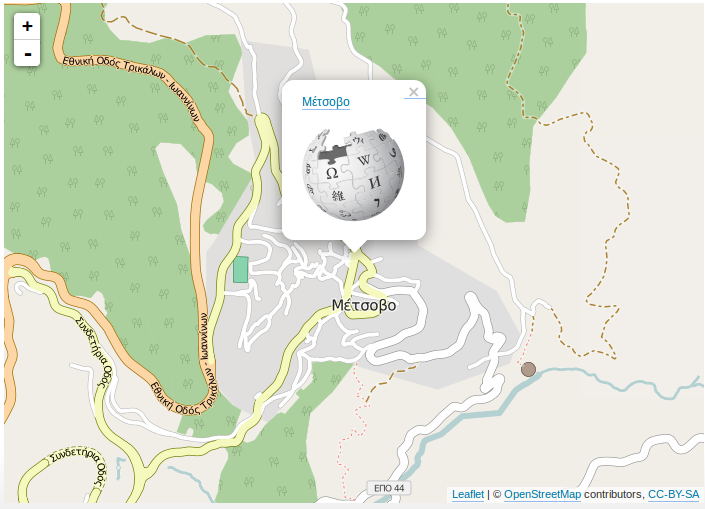
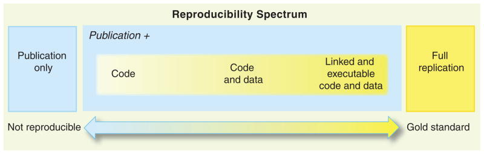

## Presentation Outline

- What is R?

- Cartography

- Spatial Analysis

- Reproducible Research


<div class="notes">
This is my *note*.

- It can contain markdown
- like this list
 
</div>


# What is R?

## What is R?
- R is a language and environment that provides a wide variety of statistical and graphical techniques, and is highly extensible. 

- R is available as Free Software under the terms of GNU General Public License.

- R is cross-platform (GNU/Linux, Windows, OS X).


  
<small><small>[r-project website](https://www.r-project.org/about.html)</small></small>


## R Popularity and Vitality

- 119 254 R questions on [StackOverflow](https://stackoverflow.com/questions/tagged/r)

- 7 727 [user-contributed packages](https://cran.rstudio.com/)

- Preferred language of self-proclaimed data scientists on [LinkedIn](http://blog.revolutionanalytics.com/2015/11/new-surveys-show-continued-popularity-of-r.html)

- Among top languages on [GitHub](http://githut.info/)

- Five updates in 2015

- 174 [Local R User Groups](http://blog.revolutionanalytics.com/local-r-groups.html), 2 in Greece ([Patras](http://www.meetup.com/Patras-R-Users-Group) & [Athens](http://www.meetup.com/AthensR/))

## R Popularity and Vitality {.smaller}
  
Sylvia Tippmann/Source: Elsevier Scopus database


## R Environment 

- R Base: [R](https://www.r-project.org/)

- User-contributed Packages: [The Comprehensive R Archive Network](http://cran.cc.uoc.gr/mirrors/CRAN/)

- Integrated Development Environment (IDE): [RStudio](https://www.rstudio.com/) 


## R Usage 

A look at RStudio and some basic examples of code...

[basic_examples.R]()


# Cartography

## {.flexbox .vcenter}

 


## Spatial Data Handling

Two fundamental packages:  

  * `sp`: handle and display of spatial objects
  * `rgdal`: import/export spatial objects, manage cartographic projections

[spatial_data_handling.R]()


## Thematic cartography

The `cartography` package allows various **cartographic representations** and some additional features: 

* Proportional symbols maps  
* Chroropleth maps   
* Typology maps    
* Flow maps   
* Discontinuities maps   
* Cartographic palettes   
* Layout   
* Nice legends   
* Access to cartographic API   
* Irregular polygons to regular grid transformation with data handling  

## Thematic cartography

Basic examples...

[basic_examples_cartography.R]()


## Thematic cartography

More customized examples in the package vignette.  

Access to the vignette in R:  
```{r, eval=FALSE}
vignette(topic = "cartography")
```
Access to the vignette on the web:   
[Commented Scripts to Build Maps with cartography](https://cran.r-project.org/web/packages/cartography/vignettes/cartography.html)


## Interactive Maps
With the `leaflet` package
```{r, eval=FALSE}
library(leaflet)
# initialize a map
m <- leaflet(width = 700, height = 500)
# add a basemap
m <- addTiles(map = m)
# center on a localization
m <- setView(map = m, lng = 21.182957, lat = 39.771098, zoom = 15)
# add a pop-up
m <- addPopups(map = m, lng = 21.182957, lat = 39.771098, 
               popup = '<a href="https://el.wikipedia.org/wiki/%CE%9C%CE%AD%CF%84%CF%83%CE%BF%CE%B2%CE%BF">
               Μέτσοβο                       </a><br/><br/>
               ')
# affichage de la carte
m
```


## Interactive Maps

```{r, echo = FALSE, message=FALSE, fig.height=6, fig.width=6, cache=FALSE, results = 'asis'}
library(leaflet)
# initialize a map
m <- leaflet(width = 700, height = 500)
# add a basemap
m <- addTiles(map = m)
# center on a localization
m <- setView(map = m, lng = 21.182957, lat = 39.771098, zoom = 15)
# add a pop-up
m <- addPopups(map = m, lng = 21.182957, lat = 39.771098, 
               popup = '<a href="https://el.wikipedia.org/wiki/%CE%9C%CE%AD%CF%84%CF%83%CE%BF%CE%B2%CE%BF">
               Μέτσοβο                       </a><br/><br/>
               ')
# affichage de la carte
m
```


## Interactive Maps



# Spatial Analysis

## {.flexbox .vcenter}
 


## Geoprocessing 

One fundamental package:  
The `rgeos` package gives access to the GEOS ([Geometry Engine - Open Source](http://trac.osgeo.org/geos/)) library.  

* Area / Perimeter 
* Distances  
* Buffer
* Overlap / intersect / difference
* Contains / within
* Union
* ...

## Distance calculation
Euclidean distance vs. Road distance

[distance.R]()


## Basic Point Pattern Analysis

An example of (very) basic point pattern analysis of geocoded tweets.

[tweets.R]()

## Discontinuities
How to extracts discontinuities (borders) between regions.

[disc.R]()


## Spatial Smoothing
The `SpatialPosition` package allow to compute Stewart potentials (gravitational potential)
$$
A_i = \sum_{j=1}^n O_j f(d_{ij})
$$

- $A_i$ potentiel en $i$
- $O_j$ stock de population sur $j$ 
- $f(d_{ij})$ fonction négative de la distance entre $i$ et $j$

[smooth.R]()


# Reproducible Research

## Reproducible Research {.smaller}

  
Roger D. Peng - 2011

## Reproducible Research

The ability to communicate complete analyses by providing the script that reruns the analysis.


*"The R Software Environment is a good choice to carry out reproducible geoscientific research.
The main argument is that the combination of (i) being a free, open source, cross-platform environment with 
clear software provenance, versioning and archiving with (ii) maintaining open, documented, accessible and sustained
communication channels between users and developers, creates trust by individuals and organisations."* **Bivand et al - 2013**


## Dynamic Report Generation

[Markdown](https://daringfireball.net/projects/markdown/), an easy-to-read and easy-to-write markup language.  

[greece_2016_with_code.Rmd]()

## This Presentation!
This presentation has been written in rMarkdown and build within RStudio.  
[greece_2016.Rmd]()


# Resources

## Resources
* [R-sig-Geo Mailing list](https://stat.ethz.ch/mailman/listinfo/r-sig-geo) *R Special Interest Group on using Geographical data and Mapping*
* [CRAN Task View: Analysis of Spatial Data](https://cran.r-project.org/web/views/Spatial.html)  
* [R-bloggers](http://www.r-bloggers.com/) *A blog aggregator of content collected from bloggers who write about R (in English).*   
* [Applied Spatial Data Analysis with R](http://link.springer.com/book/10.1007/978-1-4614-7618-4) (Roger S. Bivand, Edzer Pebesma, Virgilio Gómez-Rubio)    
* **A lot of tutorials and presentations online** 


# Thank you !

## Thank you !{.flexbox .vcenter}

[timothee.giraud@ums-riate.fr](timothee.giraud@ums-riate.fr)  


GitHub: [https://github.com/rCarto/](https://github.com/rCarto/)  


Blog: [http://rgeomatic.hypotheses.org/](http://rgeomatic.hypotheses.org/)  


